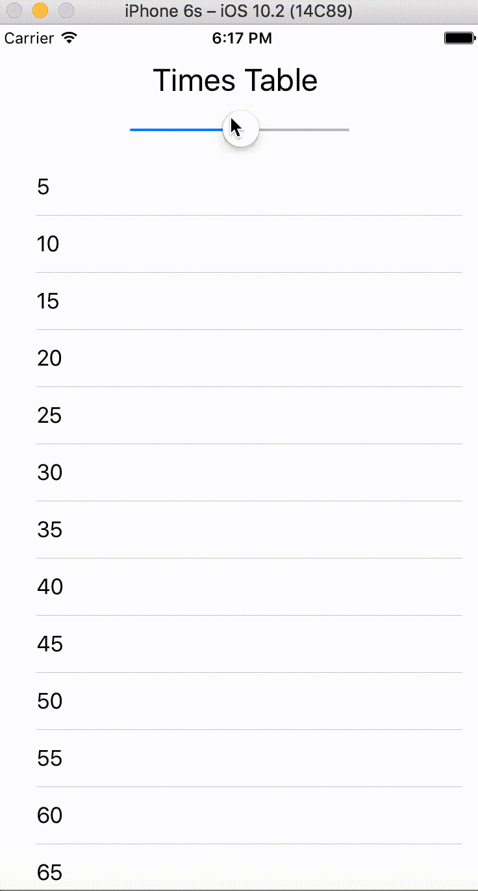

# TimesTablesApp

## Background
This is the fifth Swift App I have built through the Udemy App Development Course (link below). This app provided an intro to sliders and tables. These features will have almost endless utility in future apps to come.

## Course
The project was taken from a Udemy Intro to App Development course. More information on the course can be found at [Udemy](https://www.udemy.com/complete-ios-10-developer-course/learn/v4/content)

## Display

